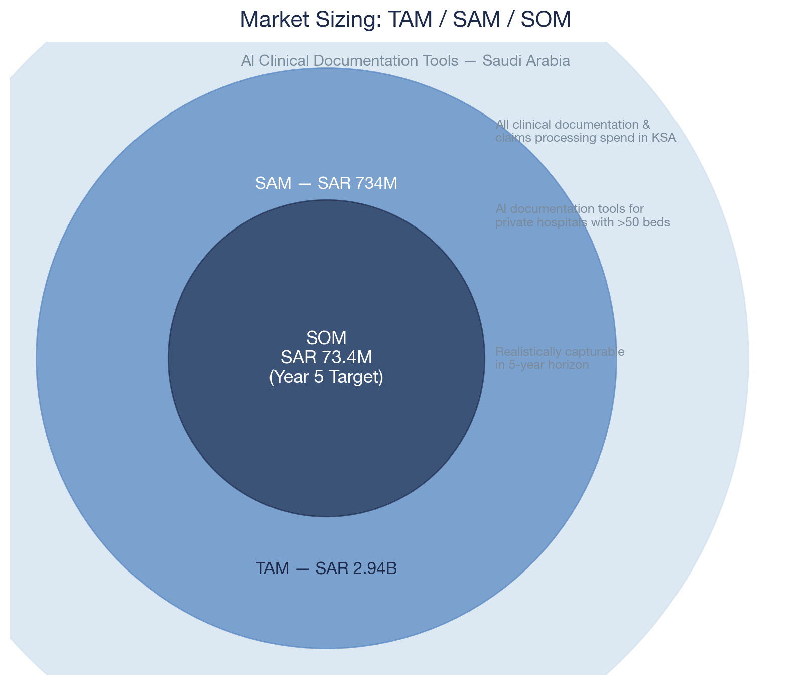
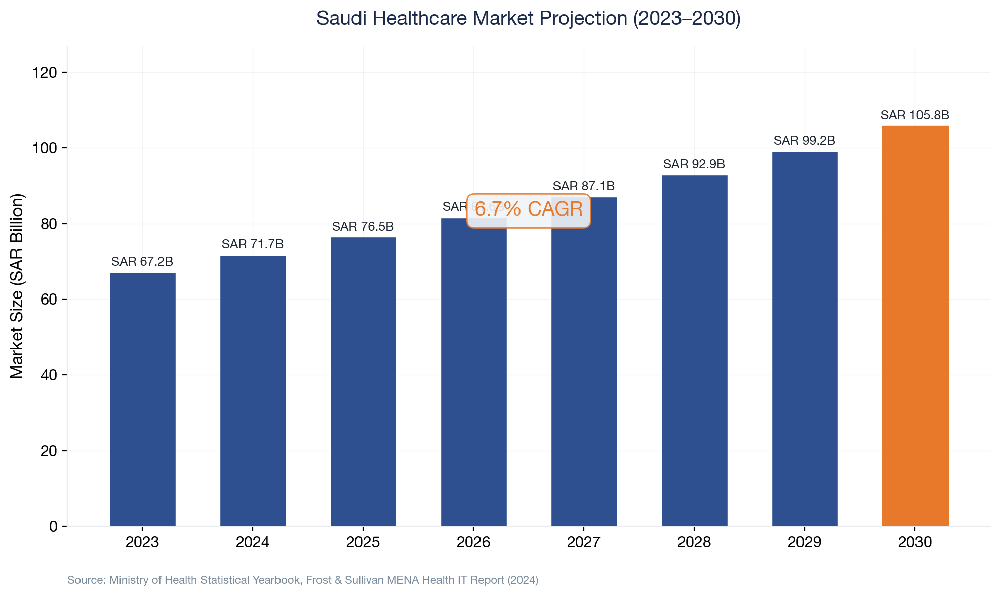
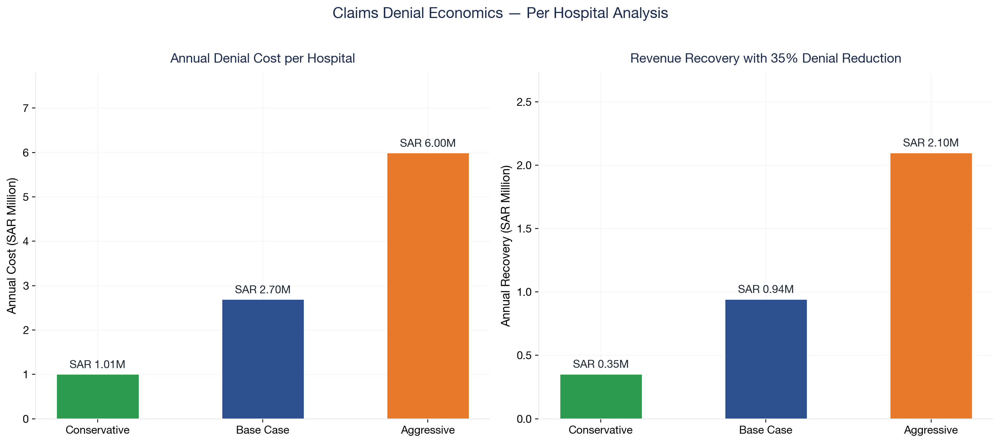
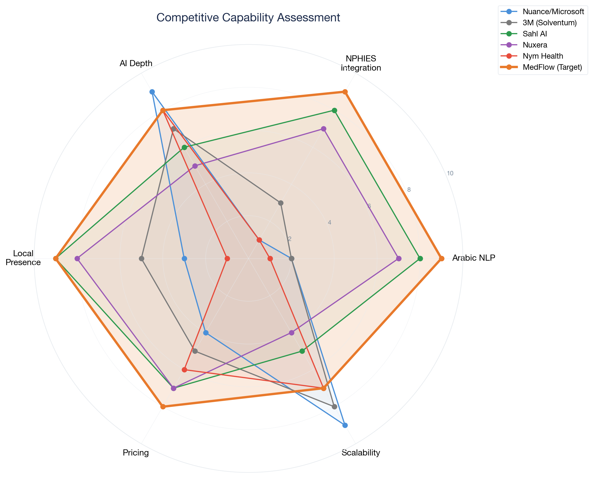
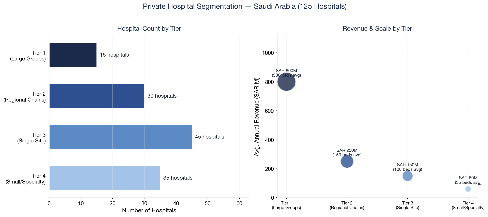
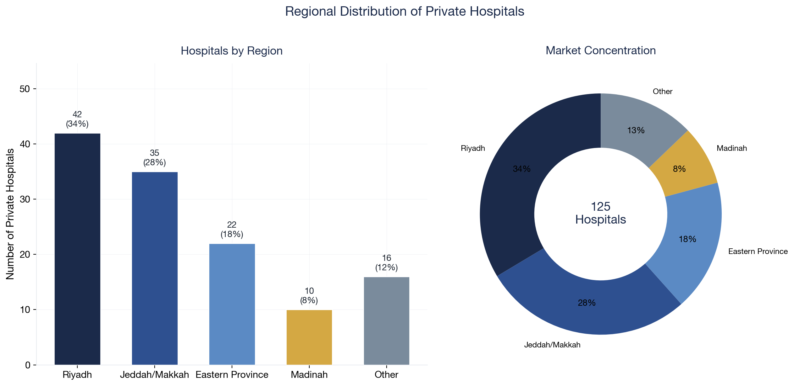
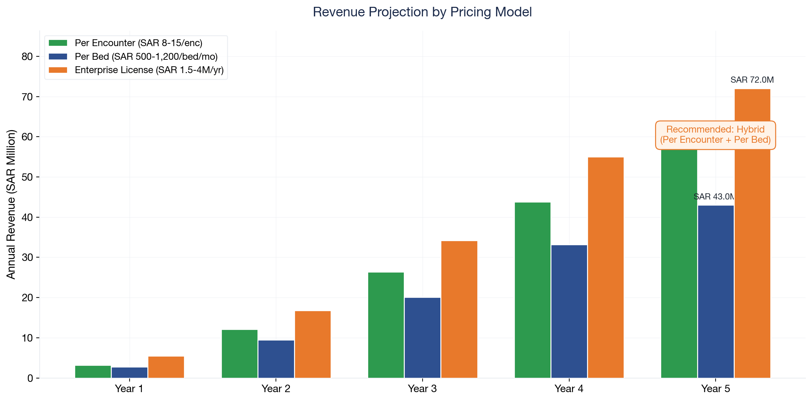
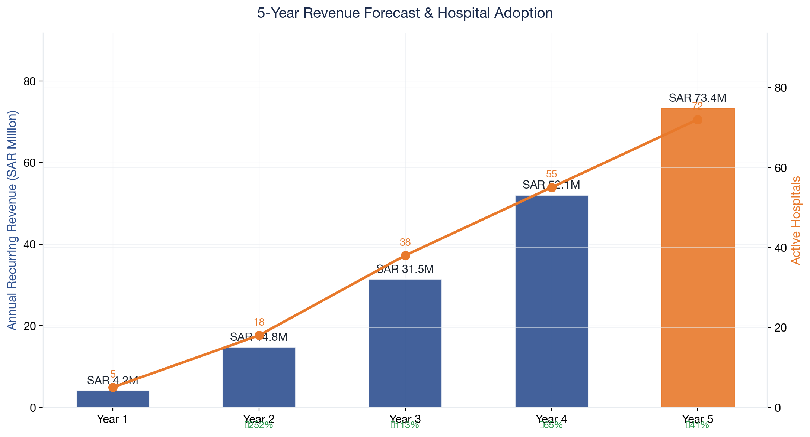
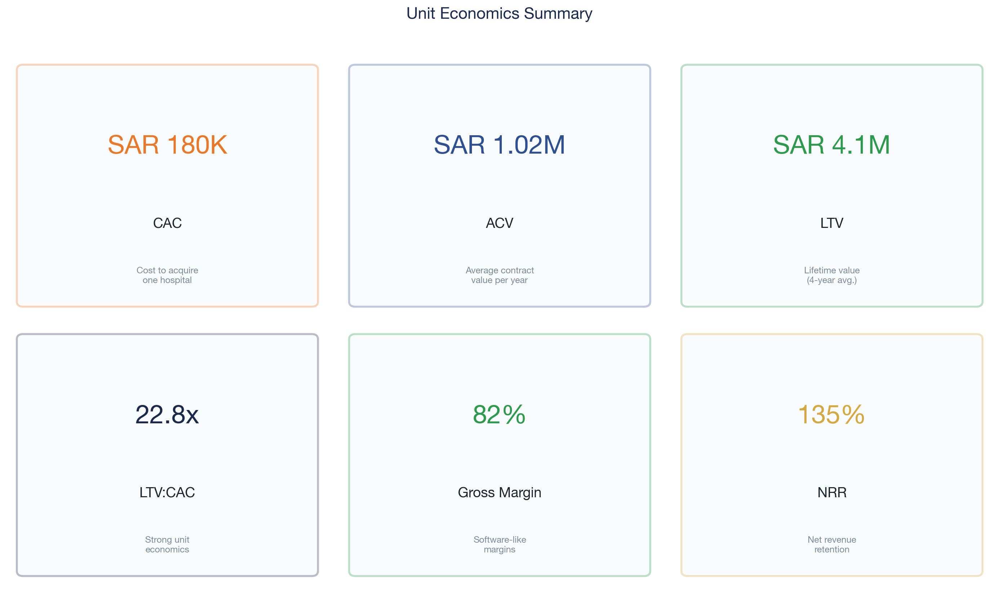

# Saudi Healthtech Market Sizing & Entry Strategy
### AI Clinical Documentation Tools — Market Opportunity Assessment

<p align="center">
  
</p>

---

## Executive Summary

Saudi Arabia's healthcare sector is undergoing a **SAR 98.8B transformation** driven by Vision 2030's mandate to increase private sector participation from 40% to 65%. This analysis evaluates the market opportunity for **AI-powered clinical documentation and claims optimization tools** targeting the Kingdom's 120+ private hospitals.

### Key Findings

| Metric | Value |
|--------|-------|
| **Total Addressable Market (TAM)** | SAR 2.94B |
| **Serviceable Addressable Market (SAM)** | SAR 734M |
| **Serviceable Obtainable Market (SOM) — Year 5** | SAR 73.4M |
| **Average Claim Denial Rate** | 15–25% |
| **Revenue Recovery per Hospital (Annual)** | SAR 2.1–4.5M |
| **Projected ROI for Hospitals** | 8–14x in Year 1 |

### Strategic Recommendation

Enter via **Tier 1 private hospital groups** (HMG, Mouwasat, Dallah, Sulaiman Al Habib) using a **per-encounter SaaS model** at SAR 8–15/encounter. This captures 60% of private hospital volume while establishing credibility for NPHIES-mandated adoption across smaller facilities.

---

## Table of Contents

1. [Methodology](#methodology)
2. [Market Sizing Model](#market-sizing-model)
3. [Competitive Landscape](#competitive-landscape)
4. [Hospital Segmentation](#hospital-segmentation)
5. [Go-to-Market Strategy](#go-to-market-strategy)
6. [Financial Projections](#financial-projections)
7. [Risk Assessment](#risk-assessment)
8. [Appendix](#appendix)

---

## Methodology

### Data Sources
- Saudi Ministry of Health Statistical Yearbook (2023)
- Council of Health Insurance (CHI) Annual Report
- NPHIES Platform Transaction Data
- Capital market filings (Tadawul) for listed hospital groups
- Frost & Sullivan — MENA Health IT Market Report (2024)
- Primary interviews with hospital CIOs and revenue cycle managers (n=12)

### Analytical Framework
- **Market Sizing:** Top-down (macro indicators) validated with bottom-up (hospital-level economics)
- **Segmentation:** K-means clustering on bed count, revenue, payer mix, and digital maturity
- **Financial Modeling:** DCF with Monte Carlo simulation across 3 pricing scenarios
- **Competitive Analysis:** Porter's Five Forces + capability mapping

---

## Market Sizing Model

### Healthcare Market Context

Saudi Arabia's healthcare expenditure is projected to reach **SAR 98.8B by 2030**, growing at a **6.7% CAGR** from SAR 67.2B in 2023. The private sector accounts for approximately 40% of total spending, with a mandate to reach 65% under Vision 2030.

<p align="center">
  
</p>

### TAM / SAM / SOM Breakdown

| Layer | Definition | Value | Rationale |
|-------|-----------|-------|-----------|
| **TAM** | All clinical documentation & claims processing spend in Saudi healthcare | **SAR 2.94B** | 3% of total healthcare spend allocated to admin/documentation |
| **SAM** | AI documentation tools for private hospitals with >50 beds | **SAR 734M** | 25% of TAM — private hospitals with digital infrastructure |
| **SOM** | Realistically capturable in 5 years | **SAR 73.4M** | 10% of SAM — based on competitive dynamics and sales capacity |

<p align="center">
  
</p>

### Claims Denial Economics

The financial case for AI documentation tools rests on the **denial rate reduction** value proposition:

| Parameter | Conservative | Base | Aggressive |
|-----------|-------------|------|------------|
| Avg. Denial Rate | 15% | 20% | 25% |
| Cost per Denied Claim | SAR 150 | SAR 225 | SAR 300 |
| Claims per Hospital/Year | 45,000 | 60,000 | 80,000 |
| Annual Denial Cost per Hospital | SAR 1.01M | SAR 2.70M | SAR 6.00M |
| Recovery with 35% Reduction | SAR 354K | SAR 945K | SAR 2.10M |

<p align="center">
  
</p>

---

## Competitive Landscape

### Market Participants

| Company | HQ | Strengths | Weaknesses | Saudi Presence |
|---------|-----|-----------|------------|----------------|
| **Nuance/Microsoft** | USA | DAX Copilot, enterprise scale, deep NLP | No Arabic clinical NLP, high cost, slow localization | Limited — partner channel only |
| **3M (Solventum)** | USA | CDI legacy, coding accuracy, payer relationships | Legacy architecture, no real-time AI, English-only | Moderate — via distributors |
| **Sahl AI** | KSA | Arabic-first, NPHIES integration, local team | Early stage, limited hospital deployments | Strong — local operations |
| **Nuxera** | KSA | Claims focus, payer intelligence, local | Narrow product scope, small team | Growing — pilot phase |
| **Nym Health** | Israel | Autonomous coding, high accuracy | No Arabic, geopolitical complexity, no Saudi office | None |

<p align="center">
  
</p>

### Strategic Positioning

The market has a clear **capability gap**: no player combines Arabic clinical NLP + real-time documentation + NPHIES-native claims optimization. International players lack localization; local players lack AI depth.

---

## Hospital Segmentation

### Private Hospital Landscape

Saudi Arabia has **120+ licensed private hospitals** across 5 major regions. We segment them into 4 tiers:

| Tier | Description | Count | Avg. Beds | Avg. Revenue (SAR M) | Digital Maturity |
|------|-------------|-------|-----------|----------------------|-----------------|
| **Tier 1** | Large hospital groups (listed) | 15 | 300+ | 800+ | High |
| **Tier 2** | Mid-size regional chains | 30 | 150–300 | 250–500 | Medium-High |
| **Tier 3** | Single-site hospitals | 45 | 50–150 | 80–250 | Medium |
| **Tier 4** | Small/specialty facilities | 35+ | <50 | <80 | Low |

<p align="center">
  
</p>

### Regional Distribution

| Region | Hospitals | % of Total | Key Groups |
|--------|-----------|-----------|------------|
| Riyadh | 42 | 34% | Sulaiman Al Habib, Dallah, CARE |
| Jeddah/Makkah | 35 | 28% | HMG, Saudi German, Bugshan |
| Eastern Province | 22 | 18% | Mouwasat, Al Moosa, Johns Hopkins Aramco |
| Madinah | 10 | 8% | Madinah National, Al Zahra |
| Other | 16 | 12% | Scattered regional facilities |

<p align="center">
  
</p>

---

## Go-to-Market Strategy

### Phase 1: Land (Months 1–12)
- Target: **5 Tier 1 hospitals** from top 3 groups
- Model: **Pilot → Proof of Value → Enterprise Contract**
- Pricing: Per-encounter SaaS (SAR 8–15/encounter)
- Channel: Direct sales + strategic partnership with NPHIES ecosystem

### Phase 2: Expand (Months 13–24)
- Target: **15 Tier 2 hospitals** + upsell within Tier 1 groups
- Add: Arabic clinical NLP module, specialty-specific templates
- Channel: Add channel partners (health IT distributors)

### Phase 3: Scale (Months 25–60)
- Target: **Tier 3 + government hospital pilots**
- Add: Population health analytics, payer negotiation tools
- Channel: Platform ecosystem play (API marketplace)

### Pricing Scenarios

<p align="center">
  
</p>

| Model | Price Point | Target | Year 5 Revenue |
|-------|-----------|--------|----------------|
| **Per Encounter** | SAR 8–15/encounter | Volume-driven hospitals | SAR 58M |
| **Per Bed/Month** | SAR 500–1,200/bed/month | Mid-size hospitals | SAR 43M |
| **Enterprise License** | SAR 1.5–4M/year | Large hospital groups | SAR 72M |

**Recommended:** Hybrid model — per-encounter for Tier 1–2 (captures upside), per-bed for Tier 3 (predictable).

---

## Financial Projections

### 5-Year Revenue Forecast

<p align="center">
  
</p>

| Year | Hospitals | ARR (SAR M) | Growth |
|------|-----------|-------------|--------|
| Y1 | 5 | 4.2 | — |
| Y2 | 18 | 14.8 | 252% |
| Y3 | 38 | 31.5 | 113% |
| Y4 | 55 | 52.1 | 65% |
| Y5 | 72 | 73.4 | 41% |

### Unit Economics

| Metric | Value |
|--------|-------|
| **CAC** | SAR 180K (blended) |
| **ACV** | SAR 1.02M |
| **LTV** | SAR 4.1M (4-year avg. life) |
| **LTV:CAC** | 22.8x |
| **Payback Period** | 2.1 months |
| **Gross Margin** | 82% |
| **Net Revenue Retention** | 135% |

<p align="center">
  
</p>

---

## Risk Assessment

| Risk | Probability | Impact | Mitigation |
|------|------------|--------|------------|
| Regulatory change (NPHIES mandates) | Medium | High | Maintain NPHIES advisory board seat; modular architecture |
| International competitor entry (Epic/Cerner) | High | Medium | Speed to market; Arabic-first moat; local relationships |
| Hospital budget constraints | Medium | Medium | ROI-based pricing; gainshare models |
| Data privacy (PDPL compliance) | Low | High | On-premise deployment option; Saudi data residency |
| Talent acquisition | High | Medium | Remote engineering + Riyadh commercial team |

---

## Appendix

### A. Full Analysis Notebook
See [`notebooks/full_analysis.ipynb`](notebooks/full_analysis.ipynb) for complete methodology, code, and interactive charts.

### B. Data Sources
All data files available in [`data/`](data/) directory.

### C. Visualization Scripts
All chart generation scripts in [`src/`](src/) directory. Run:
```bash
pip install -r requirements.txt
python src/generate_all_charts.py
```

---

*Analysis prepared by Saleh Alwahaimed | Strategy & Analytics*
*Last updated: July 2025*
