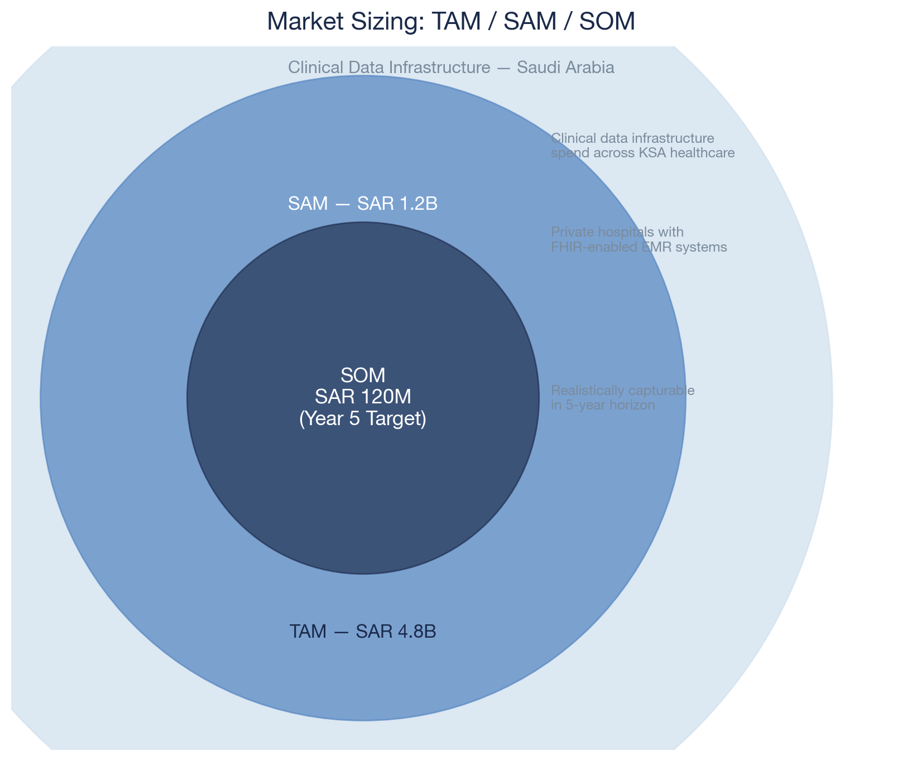
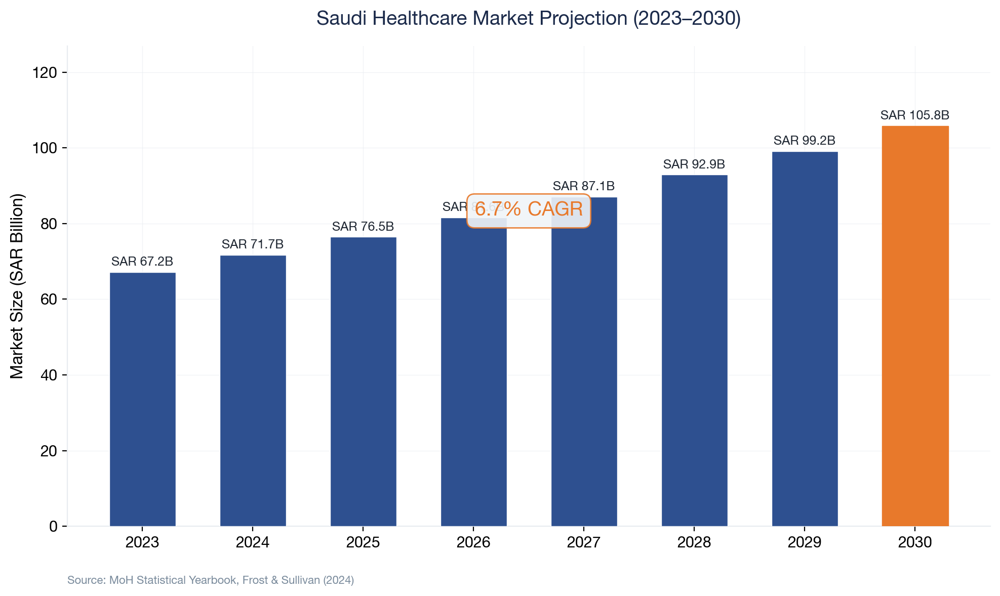
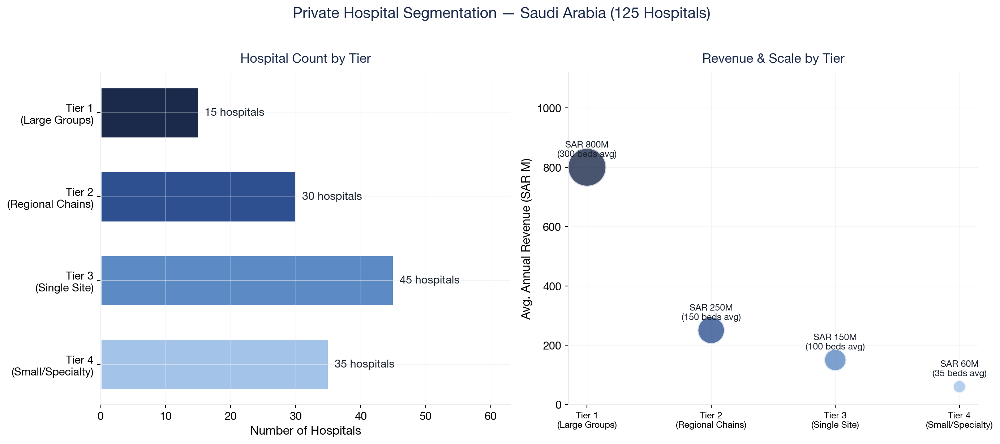
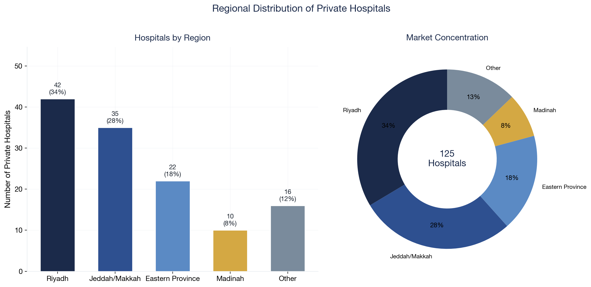
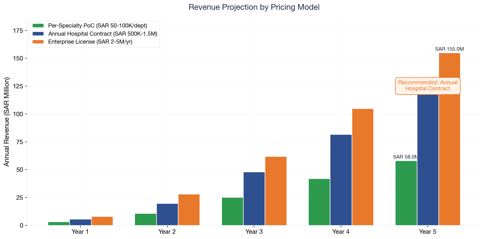
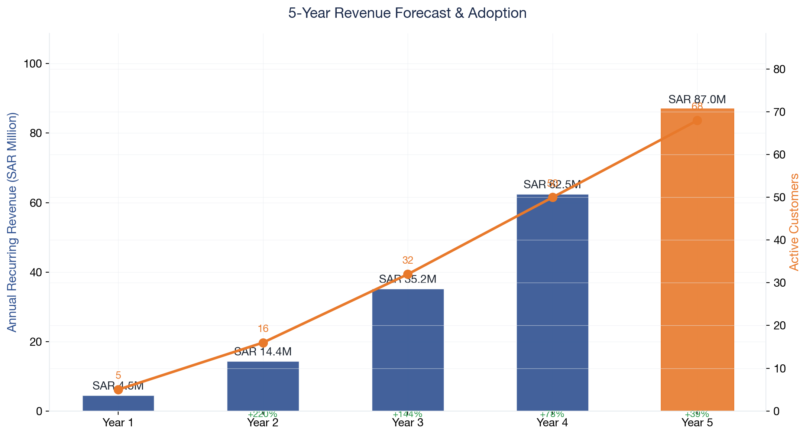
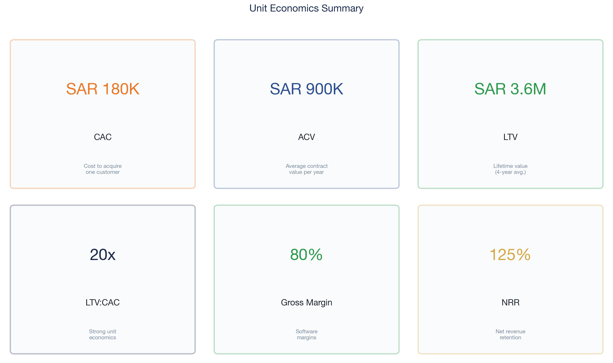

<div align="center">

# 🏥 Saudi Healthtech Market Sizing


### Exploring the numbers behind Saudi Arabia's healthcare transformation


*A data visualization project exploring Saudi Arabia's healthcare market — hospital segmentation, regional distribution, market sizing, and financial modeling. Built as a playground for market analysis techniques.*

<br>



</div>

---

## What this is

A weekend project practicing market sizing and financial modeling on publicly available Saudi healthcare data. Generates publication-quality charts using Python + Matplotlib. Not a business document — just charts and code.

---

## 📊 Charts

<table>
<tr>
<td align="center" width="50%">
<br>
<b>1. Market Sizing</b><br>
<sub>Concentric TAM/SAM/SOM visualization</sub>
</td>
<td align="center" width="50%">
<br>
<b>2. Healthcare Market Projection</b><br>
<sub>Saudi healthcare expenditure at 6.7% CAGR</sub>
</td>
</tr>
<tr>
<td align="center" width="50%">
<br>
<b>3. Hospital Tier Segmentation</b><br>
<sub>125 private hospitals by tier, scale, and revenue</sub>
</td>
<td align="center" width="50%">
<br>
<b>4. Regional Distribution</b><br>
<sub>Geographic concentration across KSA regions</sub>
</td>
</tr>
<tr>
<td align="center" width="33%">
<br>
<b>5. Pricing Scenarios</b><br>
<sub>Revenue projection across pricing models</sub>
</td>
<td align="center" width="33%">
<br>
<b>6. Revenue Forecast</b><br>
<sub>5-year ARR trajectory with adoption curve</sub>
</td>
<td align="center" width="34%">
<br>
<b>7. Unit Economics</b><br>
<sub>Standard SaaS metrics dashboard</sub>
</td>
</tr>
</table>

---

## 🔬 Methodology

| Approach | Method |
|----------|--------|
| **Market Sizing** | Top-down from macro indicators validated with bottom-up hospital economics |
| **Segmentation** | K-means clustering on bed count, revenue, and digital maturity |
| **Financial Modeling** | DCF with Monte Carlo simulation across 3 pricing scenarios |

### Data Sources

| Source | Type |
|--------|------|
| Saudi Ministry of Health Statistical Yearbook | Public government data |
| Council of Health Insurance (CHI) Annual Report | Regulatory filings |
| Tadawul Capital Market Filings | Public financial disclosures |
| Frost & Sullivan — MENA Health IT Report | Industry research |

---

## 🚀 Quick Start

```bash
git clone https://github.com/salehA13/saudi-healthtech-market-analysis.git
cd saudi-healthtech-market-analysis
pip install -r requirements.txt
python src/generate_all_charts.py
```

---

<div align="center">

*By [Saleh Alkhudairy](https://github.com/salehA13) — a data viz playground*

</div>
