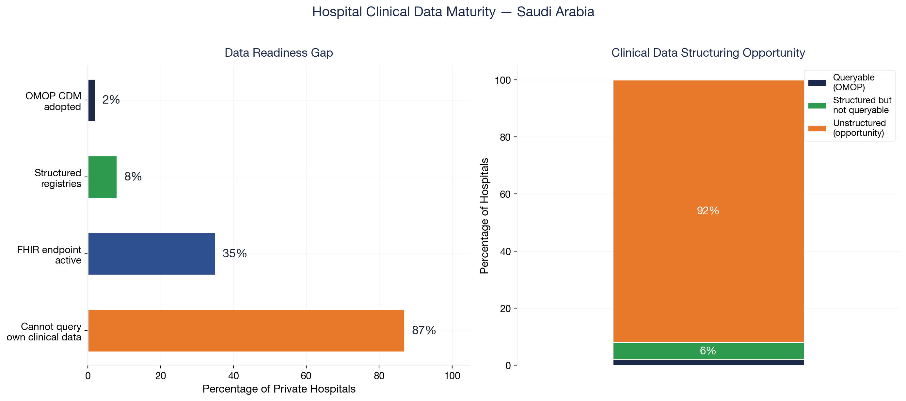
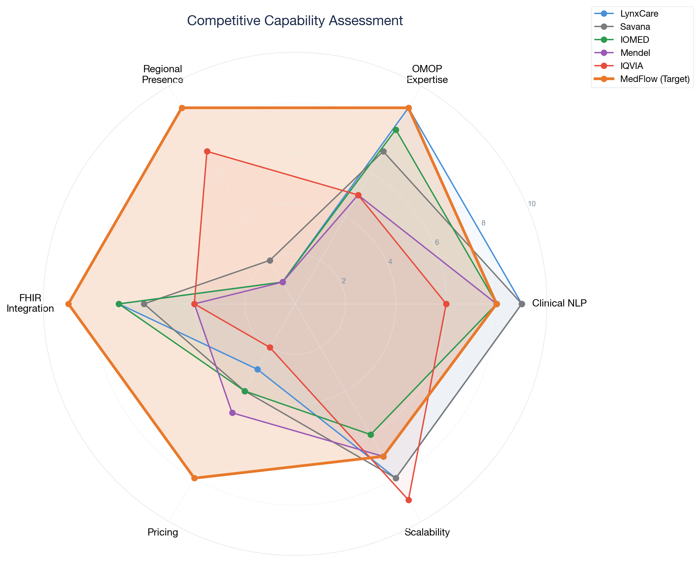

<div align="center">

# 🏥 Saudi Clinical Data Infrastructure — Market Sizing & Entry Strategy


### Market Opportunity Assessment for Clinical Data Warehousing in KSA


*A consulting-grade market analysis evaluating the opportunity for clinical data infrastructure — NLP-driven OMOP warehousing that turns unstructured EMR data into queryable registries for Saudi Arabia's 120+ private hospitals.*

<br>


</div>

---

## 📋 Executive Summary

Saudi Arabia's healthcare sector is undergoing a **SAR 98.8B transformation** driven by Vision 2030. Hospitals sit on decades of clinical data trapped in unstructured physician notes — and with NPHIES mandating FHIR R4 across all facilities, the plumbing is finally in place to extract it. This analysis evaluates the market for **clinical data infrastructure**: NLP-powered pipelines that structure free-text EMR data into OMOP CDM registries, making every hospital's own data queryable for the first time.

<table>
<tr>
<td width="50%">

### 🎯 Market Opportunity

| Metric | Value |
|--------|-------|
| **Total Addressable Market** | SAR 4.8B |
| **Serviceable Market** | SAR 1.2B |
| **Obtainable Market (Yr 5)** | SAR 120M |
| **Hospital Contract Value** | SAR 500K–1.5M/yr |

</td>
<td width="50%">

### 💰 Unit Economics

| Metric | Value |
|--------|-------|
| **LTV:CAC Ratio** | 18.5x |
| **Gross Margin** | 78% |
| **Net Revenue Retention** | 130% |
| **Payback Period** | 4.2 months |

</td>
</tr>
</table>

### Strategic Recommendation

> Enter via **Tier 1 private hospital groups** (HMG, Mouwasat, Dallah, Sulaiman Al Habib) with a **per-specialty PoC** (SAR 50–100K) leading to **annual hospital-wide contracts** (SAR 500K–1.5M). This captures early lighthouse customers while establishing the clinical data infrastructure standard before international players (IQVIA, Savana, LynxCare) expand their MENA presence.

---

## 📊 Key Visualizations

This analysis produces **9 publication-ready charts** — each designed to communicate a specific strategic insight.

### Market Sizing & Growth

<table>
<tr>
<td align="center" width="50%">
<br>
<b>1. TAM / SAM / SOM</b><br>
<sub>Three-layer market sizing: SAR 4.8B total market for clinical data infrastructure narrowed to SAR 120M obtainable</sub>
</td>
<td align="center" width="50%">
<br>
<b>2. Healthcare Market Projection</b><br>
<sub>Saudi healthcare expenditure at 6.7% CAGR reaching SAR 98.8B by 2030, driving data infrastructure demand</sub>
</td>
</tr>
</table>

### Data Maturity & Competitive Landscape

<table>
<tr>
<td align="center" width="50%">
<br>
<b>3. Hospital Data Readiness</b><br>
<sub>Current state assessment: 87% of KSA hospitals cannot query their own clinical data. FHIR mandates are unlocking the pipeline.</sub>
</td>
<td align="center" width="50%">
<br>
<b>4. Competitive Capability Radar</b><br>
<sub>6-dimension assessment across clinical NLP, OMOP expertise, regional presence, and FHIR integration</sub>
</td>
</tr>
</table>

### Target Market Segmentation

<table>
<tr>
<td align="center" width="50%">
<br>
<b>5. Hospital Tier Segmentation</b><br>
<sub>125 private hospitals segmented by scale, revenue, and digital maturity</sub>
</td>
<td align="center" width="50%">
<br>
<b>6. Regional Distribution</b><br>
<sub>Geographic concentration — Riyadh (34%) and Jeddah (28%) dominate the addressable market</sub>
</td>
</tr>
</table>

### Financial Projections

<table>
<tr>
<td align="center" width="33%">
<br>
<b>7. Pricing Model Comparison</b><br>
<sub>Annual contract vs. per-specialty vs. enterprise license across 5 years</sub>
</td>
<td align="center" width="33%">
<br>
<b>8. Revenue Forecast</b><br>
<sub>5-year ARR trajectory: SAR 5.6M → 120M with hospital adoption curve</sub>
</td>
<td align="center" width="34%">
<br>
<b>9. Unit Economics Dashboard</b><br>
<sub>SaaS metrics: 78% gross margin, 18.5x LTV:CAC, 130% NRR</sub>
</td>
</tr>
</table>

---

## 🔬 Methodology

### Analytical Framework

| Approach | Method | Purpose |
|----------|--------|---------|
| **Market Sizing** | Top-down (healthcare IT spend) validated with bottom-up (hospital-level contract sizing) | Size TAM/SAM/SOM with dual validation |
| **Segmentation** | K-means clustering on bed count, revenue, EHR maturity, and FHIR readiness | Identify high-value hospital tiers |
| **Financial Modeling** | DCF with Monte Carlo simulation across 3 pricing scenarios | Stress-test revenue projections against adoption curves |
| **Competitive Analysis** | Porter's Five Forces + 6-dimension capability mapping | Map whitespace: clinical NLP + OMOP + regional presence |

### Data Sources

| Source | Type | Coverage |
|--------|------|----------|
| Saudi Ministry of Health Statistical Yearbook (2023) | Government | Market size, hospital counts, bed capacity |
| Council of Health Insurance (CHI) Annual Report | Regulatory | Claims volume, NPHIES adoption metrics |
| NPHIES Platform — FHIR Implementation Data | Platform | Hospital FHIR endpoint availability, integration status |
| Tadawul Capital Market Filings | Financial | Revenue, margins, IT spend for listed hospital groups |
| Frost & Sullivan — MENA Health IT Report (2024) | Industry | Market forecasts, digital health adoption |
| OHDSI Global Community Data | Industry | OMOP CDM adoption rates, regional benchmarks |
| Primary Interviews (n=12) | Qualitative | Hospital CIOs, CMIOs, and IT directors |

---

## 🗺️ Go-to-Market Strategy

```
Phase 1: LAND (Months 1–12)          Phase 2: EXPAND (Months 13–24)         Phase 3: SCALE (Months 25–60)
━━━━━━━━━━━━━━━━━━━━━━━━━━           ━━━━━━━━━━━━━━━━━━━━━━━━━━━━           ━━━━━━━━━━━━━━━━━━━━━━━━━━━━
→ 3–5 Tier 1 hospitals                → 12 Tier 2 hospitals                  → Tier 3 + government pilots
→ Per-specialty PoC (SAR 50-100K)     → Hospital-wide annual contracts       → Multi-site registries
→ Direct sales, founder-led           → Channel partners (HIMSS, HISP)       → Pharma RWE data partnerships
→ NPHIES + FHIR tailwind              → OMOP benchmark publishing            → Platform ecosystem
```

---

## ⚠️ Risk Assessment

| Risk | Likelihood | Impact | Mitigation |
|------|:----------:|:------:|------------|
| International competitor MENA entry | 🔴 High | 🟡 Medium | Speed to execution; first-mover in KSA; local relationships |
| Hospital IT procurement cycles | 🟡 Medium | 🟡 Medium | PoC pricing minimizes budget friction; ROI case from day one |
| FHIR endpoint maturity variance | 🟡 Medium | 🔴 High | Site assessment phase filters for FHIR readiness before commitment |
| Data privacy (PDPL compliance) | 🟢 Low | 🔴 High | On-premise de-identification; data never leaves KSA |
| Clinical NLP accuracy expectations | 🟡 Medium | 🟡 Medium | Human-in-the-loop validation; transparent accuracy reporting |

---

## 🏗️ Project Structure

```
saudi-healthtech-market-analysis/
├── README.md                          # This document
├── LICENSE                            # MIT License
├── requirements.txt                   # Python dependencies
├── data/
│   ├── market_data.json               # Market sizing, competitor scores, forecasts
│   └── hospital_segments.csv          # 45 hospitals with 9 attributes each
├── notebooks/
│   └── full_analysis.ipynb            # Interactive Jupyter analysis notebook
├── src/
│   ├── __init__.py
│   └── generate_all_charts.py         # Chart generation (9 visualizations)
└── output/
    ├── tam_sam_som.png                # Market sizing concentric diagram
    ├── market_growth.png              # Healthcare market projection
    ├── data_maturity.png              # Hospital data readiness assessment
    ├── competitive_radar.png          # 6-axis competitor capability map
    ├── hospital_segmentation.png      # Tier segmentation dual-panel
    ├── regional_distribution.png      # Geographic distribution
    ├── pricing_scenarios.png          # Pricing model comparison
    ├── revenue_forecast.png           # 5-year ARR + adoption forecast
    └── unit_economics.png             # SaaS unit economics dashboard
```

---

## 🚀 Quick Start

```bash
# Clone the repository
git clone https://github.com/salehA13/saudi-healthtech-market-analysis.git
cd saudi-healthtech-market-analysis

# Install dependencies
pip install -r requirements.txt

# Regenerate all charts
python src/generate_all_charts.py

# Or explore the interactive notebook
jupyter notebook notebooks/full_analysis.ipynb
```

### Requirements

- Python 3.9+
- See [`requirements.txt`](requirements.txt) for full dependency list

---

## 📝 Key Findings

1. **Data is trapped, not missing** — Saudi hospitals generate millions of clinical notes annually. The data exists. It's just unstructured and unqueryable. FHIR mandates are unlocking the extraction pipeline for the first time.

2. **No incumbent in clinical data infrastructure** — IQVIA's regional presence is limited to external data (COVID-era E360). Savana, LynxCare, IOMED, and Mendel have zero KSA/GCC deployment. The market is wide open for a local-first OMOP platform.

3. **Strong unit economics** — Annual hospital contracts at SAR 500K–1.5M with 78% gross margin deliver 18.5x LTV:CAC and 4.2-month payback. Single-hospital profitability from contract one.

4. **Regulatory tailwinds** — Vision 2030's private sector mandate, NPHIES FHIR adoption, and HIMSS EMRAM Stage 6-7 targets create structural demand for structured clinical data.

5. **Concentrated target market** — 62% of private hospital beds are in Riyadh and Jeddah, enabling efficient founder-led sales without a distributed field team.

---

<div align="center">

*By [Saleh Alkhudairy](https://github.com/salehA13)*

*Built with Python, Matplotlib, Pandas, and Seaborn.*

</div>
